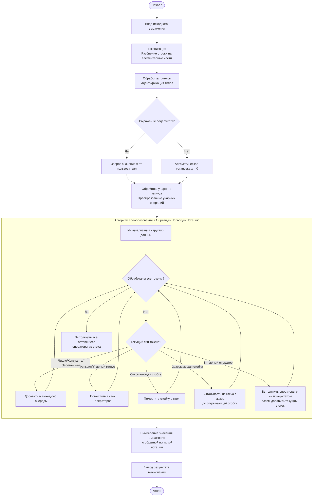

# Отчет к домашнему заданию №3 "Создание консольного калькулятора"

## Краткое описание

Разработана программа для вычисления математических выражений с использованием алгоритма преобразования в обратную польскую нотацию (RPN). Решение поддерживает базовые операции, математические функции,константы и переменные.

## Задачи работы
- Реализовать лексический анализатор для разбора математических выражений на отдельные составляющие (токены)
- Разработать алгоритм преобразования инфиксной записи в постфиксную
- Реализовать алгоритм для вычисления значения выражения в постфиксной нотации
- Реализовать корректную обработку всех компонентов арифметического выражений (чисел, констант, переменных, операторов, функций, скобок)

## Теоретические основы

В основе программы лежит алгоритм сортировочной станции для преобразования инфиксной записи выражений в постфиксную (RPN). Данный подход устраняет необходимость в скобках для определения приоритета операций и позволяет реализовать вычисления с использованием стека.

## Ключевые компоненты:

- 1. Лексический анализатор – разбивает ввод на токены (числа, операторы, функции, скобки)
- 2. Препроцессор – определяет унарные минусы и обрабатывает специальные символы
- 3. Конвертер в RPN – преобразует выражение в постфиксную форму
- 4. Вычислитель – интерпретирует постфиксную запись с использованием стека
- 5. Интерфейс – обеспечивает взаимодействие с пользователем
 
## Поддерживаемые элементы:

- Операции: +, -, *, /
- Функции: sin, cos, tg, ctg, exp
- Константы: PI, E
- Переменная: X
- Скобки и унарный минус

## Принцип работы

- 1. Получение математического выражения от пользователя
- 2. Токенизация входной строки с сохранением позиций элементов
- 3. Преобразование в RPN с учётом приоритетов операций
- 4. Запрос значения переменной X (при её наличии)
- 5. Вычисление результата путём обработки постфиксной записи

## Для наглядности продемонстрируем принцип работы программы с помощью блок-схемы ниже

## Заключение

Создано консольное приложение, способное корректно обрабатывать сложные математические выражения. Реализация демонстрирует эффективное применение алгоритмов обработки выражений, включая преобразование нотаций и стековые вычисления.
